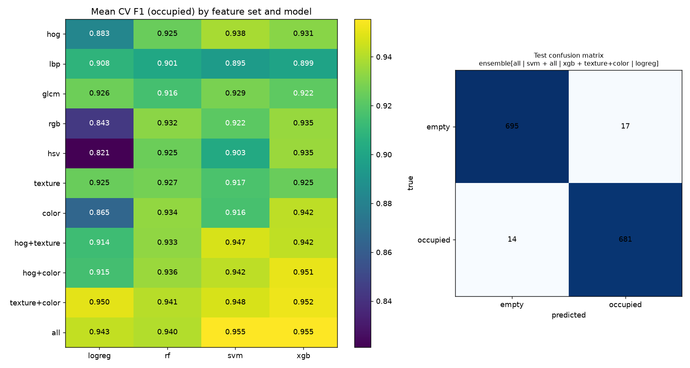
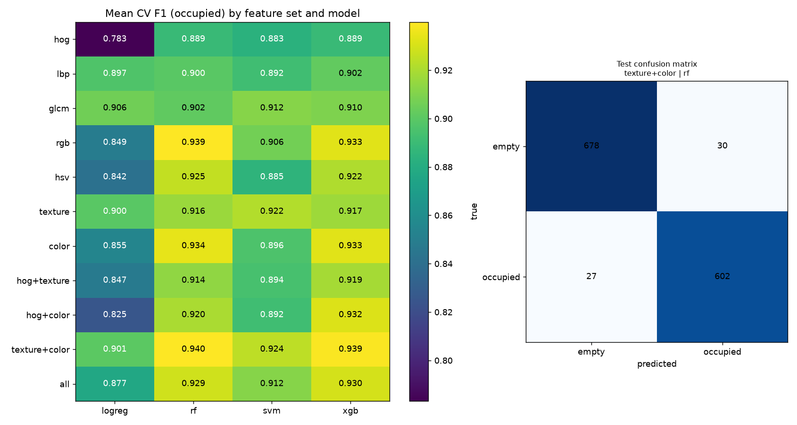
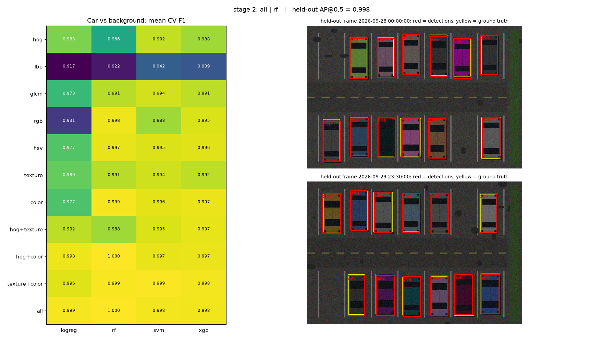
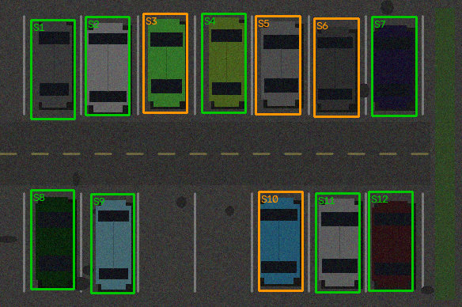
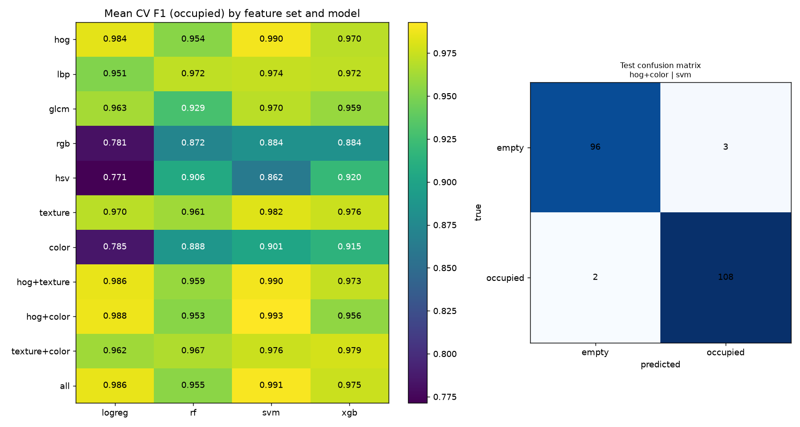

# Dynamic Parking Allotment for Residential Societies

Residential societies have fixed, allotted parking, yet many allotted spots sit
empty for long stretches (owners away at the office) while guests have nowhere to
park. This project:

1. **Identifies parking spots** in a fixed camera view.
2. **Classifies each spot as empty or occupied** using classical CV features
   (HOG, LBP/GLCM, RGB/HSV histograms) with Logistic Regression, Random Forest,
   SVM and XGBoost, and **selects the best model**.
3. **Learns when each spot is usually free** (for example, flat 101 leaves at 9:00
   and returns at 18:30 on weekdays) from the occupancy log.
4. **Gives free spots to guests** for a requested number of hours, but only
   when the spot is very likely to stay free for the whole visit.

**Camera placement:** a fixed camera mounted high (~10 m) on the **side** of
the parking area, looking diagonally across the rows, as in malls.
(Prof. Kulkarni's first suggestion was ~10 ft, looking along the lane; the code
supports both.) Spots then look like quadrilaterals. Each spot is
perspective-warped to an upright patch before classification, so near and far
spots look alike to the model.

---

## Plan

| Phase | What | Status |
|---|---|---|
| **0. Setup** | Repo structure, feature extraction, model comparison, scheduler, tests | ✅ done (this commit) |
| **1. Data** | (a) Public benchmarks: **CNRPark-EXT** (elevated cameras, similar to our setup, 150×150 spot patches, sunny/overcast/rainy) and **PKLot** (top-down, about 700k patches). (b) **Our own society**: mount or borrow a camera at about 10 ft, capture a frame every 1–5 min for 1–2 weeks, mark spots once with `annotate_spots.py`, crop with `crop_patches.py`, then label (pre-label with the benchmark model and fix the mistakes) | ⏳ next |
| **2a. Car detector** | Sliding-window detector on whole frames, built from the same features and models: a fast HOG-linear stage 1, then the best (feature set × model) from the comparison as stage 2, plus hard-negative mining and NMS. Evaluated by AP@0.5 on held-out scenes/days | ✅ pipeline; ⏳ real data |
| **2b. Spot discovery** | Spots found automatically from car activity: a place where a car stays parked, then leaves (or was empty before it arrived), verified by an appearance change. Passing cars never form a stay. Manual polygons are still available as a fallback | ✅ v1 |
| **3. Occupancy model** | Features: HOG, LBP, GLCM, RGB and HSV histograms, plus combinations (11 feature sets). Models: LogReg, RF, SVM, XGBoost. Grouped CV (by camera/day, to avoid leakage), optional grid-search of the top N, soft-voting ensemble of the top model families, selection on CV F1, one final held-out test | ✅ pipeline; ⏳ run on real data |
| **4. Robustness** | Cross-dataset tests (train PKLot → test CNRPark, train benchmark → test our society), weather/night breakdown, per-spot error analysis (far spots, pillar occlusion), temporal smoothing across frames | ⏳ |
| **5. Availability model** | Occupancy log → time-slot grid → P(spot stays free for the whole window) from comparable past days (weekday vs. weekend), with a safety buffer for residents who return early | ✅ v1 |
| **6. Guest allotment** | Rank spots by that probability, plus resident "I'm away" declarations, live camera status and existing bookings; book the best spot above a confidence threshold | ✅ v1 |
| **7. Evaluation of allotment** | Replay held-out weeks: how often would a guest have been bumped (resident returned early)? Trade-off between utilisation and conflicts as the threshold changes | ⏳ |
| **8. Demo / report** | Live overlay of free/occupied spots, a simple booking UI or WhatsApp bot, and the write-up | ⏳ |

Possible extensions: compare against a small CNN (MobileNet / mAlexNet from the
CNRPark paper) as an upper bound, model residents' leave/return times directly
(survival model) instead of empirical rates, and notify the resident when a guest
is parked in their spot.

---

## Datasets (real data only)

Target camera: **elevated (~10 m), on the side of the car park, looking diagonally
across the rows**, like mall CCTV.

```bash
python scripts/download_datasets.py side --patches   # ACPDS + NDISPark + CNRPark+EXT
python scripts/download_datasets.py pklot            # optional, ~4.6 GB
```

| Dataset | View | Labels | Size | Use it for |
|---|---|---|---|---|
| **ACPDS** (Marek 2021) | **~10 m high, every image a different side/diagonal view**: the closest match | 4-corner polygon per space + occupied/free; train/valid/test split **by parking lot** | 293 images, ~10k spaces | Occupancy classifier on unseen lots; spot polygons |
| **NDISPark** (Ciampi 2021) | 7 parking-lot cameras, various elevated angles, **day and night**, occlusions | **Every car boxed** (COCO) | ~250 images | **Car detector**: the only one here with true car boxes |
| **CNRPark-EXT** (Amato 2017) | 9 building cameras; **cams 1, 2, 3, 9 are diagonal side views**, 4–8 look straight across | Square per space + occupied/free; per-frame time series | 4,081 frames, ~145k patches, 23 days, every 30 min | Occupancy classifier (most data); real time series for discovery/scheduler |
| PKLot (Almeida 2015) | Rooftops, nearly bird's-eye | Polygon per space + occupied/free | 12,417 frames | Lowest priority for this camera; cross-dataset check |

Notes:
* Only NDISPark labels every car. The others label parking *spaces*, so for the
  detector positives = occupied spaces, negatives = free spaces only (random
  background crops could contain unlabelled cars).
* CNRPark-EXT downloads from GitHub. ACPDS (Cloudflare R2) and NDISPark (Zenodo)
  come from other hosts. All are public; cite the papers listed in
  `scripts/download_datasets.py`.

### First real result: occupancy classifier on CNR-EXT

6,000 patches (3,000 per class) from all 9 cameras, split **by camera**: the test
cameras are never seen in training, which simulates a new society. 5-fold grouped CV.

| | CV F1 (unseen cameras) | Held-out test F1 | Latency / patch |
|---|---|---|---|
| **Selected: soft-vote of `all|svm` + `all|xgb` + `texture+color|logreg`** | 0.963 ± 0.018 | **0.978** (31 errors / 1,407) | 0.42 ms |
| `all | xgb` (single model, fastest good option) | 0.955 ± 0.021 | 0.975 | 0.01 ms |
| `all | svm` | 0.956 ± 0.028 | 0.975 | 0.50 ms |
| `hog | logreg` | 0.883 ± 0.077 | — | — |
| `color | logreg` | 0.865 ± 0.038 | — | — |

Takeaways: combining shape (HOG), texture (LBP/GLCM) and colour beats any single
group; tree models and SVM beat LogReg. Scores vary a lot between cameras (see the
± values), so a new camera's viewpoint matters. Full table:
`docs/cnrext_occupancy_leaderboard.csv`.



### Side-angled cameras only (our camera placement): CNR-EXT cameras 1, 2, 3, 9

Same protocol, restricted to the four diagonal side-view cameras. 6,000 patches.
Trained/CV'd on cameras 1, 2, 9 (leave-one-camera-out), **tested on camera 3,
never seen**.

| Feature set | Best model | CV F1 (unseen camera) |
|---|---|---|
| hog | RF | 0.889 ± 0.052 |
| texture (LBP+GLCM) | SVM | 0.922 ± 0.034 |
| color (RGB+HSV) | RF | 0.934 ± 0.029 |
| **texture+color** | **RF** | **0.940 ± 0.032** ← selected |
| all | XGBoost | 0.930 ± 0.039 |

**Held-out camera 3: F1 0.955, ROC-AUC 0.994** (57 errors / 1,337).
`texture+color | xgb` scored 0.962 at 0.009 ms/patch, a good deployment choice.

**Finding:** from diagonal side views, **HOG (shape) is the weakest
feature** (it was the backbone for straight-across views). A car's outline
changes a lot with the viewing angle, while texture and colour don't. For a
mall-style camera, prioritise texture+colour features.
Full table: `docs/cnrext_side_cams_leaderboard.csv`.



## Car detection and spot discovery

```
frames ──► car detector ──► car boxes per frame ──► cluster over time into "sites"
                                                      │
          stays (car parked ≥ 45 min, detected in ≥ 75% of those frames)
          departures / arrivals (empty ≥ 30 min, appearance really changed)
                                                      │
       confirmed spot (seen occupied AND empty) · candidate (never left) · dropped (passing car)
                                                      │
                                spots.json  +  occupancy_log.csv  ──► guest scheduler
```

* **Detector stage 1:** a linear model on HOG. For each window size the frame is
  rescaled once, and every position is scored by sliding the weights over the HOG
  block grid. Its threshold keeps 99% of training cars, so it only removes obvious
  background.
* **Detector stage 2:** the best of 44 (feature set × LogReg / RF / SVM / XGBoost)
  combinations, chosen by grouped CV on car vs. background patches. Negatives
  include empty bays and *partially* covered cars, so it only fires on a
  well-centred car. Then one round of hard-negative mining.
* **Window sizes:** k-means on the annotated car boxes, so the detector adapts to the
  camera.
* **Limitation:** a bay that never has a car during the observation period
  can't be found this way. Run discovery for at least a few weekdays, or add
  such bays by hand.

```bash
python scripts/make_synthetic_scenes.py                  # 3 training scenes + 1 unseen discovery scene
python scripts/train_detector.py --scenes data/scenes/train_* --max-frames 80 --cv 4 --out outputs/detector
python scripts/discover_spots.py --detector outputs/detector/car_detector.joblib \
       --frames data/scenes/discovery/frames --ground-truth data/scenes/discovery/annotations.json
```

**Synthetic check (pipeline only, not a real result).** Trained on 80 frames from
3 synthetic scenes and tested on held-out scene-days. Selected stage 2:
`all | rf`. Detection AP@0.5 = 0.998 (P 0.997, R 0.998), about 1 s per frame.
Discovery on an *unseen* scene (2 days, one frame every 10 min) found 12/12 bays
that ever had a car (8 confirmed, 4 candidates: the never-moving cars and the
work-from-home residents who didn't leave). There were 0 false spots and 0 spots
in the driving lane. The 2 bays that were never used were (as expected) not
found.

 

Real data for the detector: **PKLot** (full frames + XML: `--pklot PKLot/PKLot`)
or its **Roboflow YOLO export** (`--yolo .../train/images --car-classes 1
--empty-classes 0 --no-random-negatives --test-yolo .../valid/images`). These
datasets only label cars inside spaces, so `--no-random-negatives` keeps
unlabelled cars in the lanes out of the negatives. Any frames you label yourself
in YOLO format (Roboflow, CVAT, Label Studio) also work.

## Layout

```
parking/
  features.py    HOG, LBP, GLCM, RGB/HSV histogram features (named blocks, combinable)
  data.py        dataset loaders: folder layout (PKLot / own crops) and CNRPark label lists
  models.py      LogReg / RF / SVM / XGBoost candidates, soft-vote ensemble, saved-model bundle
  selection.py   grouped CV over feature set x model, tuning, ensemble, best-model selection
  spots.py       spot polygons (JSON), perspective crop, overlay drawing
  detect.py      per-frame classification and temporal smoothing
  scheduler.py   occupancy history -> availability model -> guest allocator
  annotations.py frame-level car boxes (scene JSON / YOLO / PKLot XML), IoU, NMS, patch sampling
  detector.py    two-stage sliding-window car detector, hard negatives, AP evaluation
  discovery.py   spot discovery from detections over time + evaluation against true bays
  scenes.py      synthetic camera sequences (residents arriving/leaving, lane traffic)
  synthetic.py   synthetic patches/frames/logs for tests & demos only
scripts/
  annotate_spots.py   click 4 corners per spot on a reference frame -> spots.json
  crop_patches.py     crop all spots from many frames -> training patches
  train_models.py     feature extraction + model comparison + selection
  detect.py           run on image / folder / video / RTSP, write overlay + occupancy log
  guest_demo.py       learn availability from a log, allot guests
  make_synthetic.py   generate demo data
  make_synthetic_scenes.py  synthetic frame sequences for the detector / discovery
  train_detector.py   train + select + evaluate the car detector
  discover_spots.py   detector over a frame sequence/video -> spots.json + occupancy log
tests/               pytest suite (synthetic data)
```

## Quick start

```bash
pip install -r requirements.txt
python -m pytest                         # ~15 s

# End-to-end demo on synthetic data
python scripts/make_synthetic.py
python scripts/train_models.py --data data/synthetic/patches --group-level 0 --tune-top 3 --out outputs/synth
python scripts/detect.py --model outputs/synth/best_model.joblib --spots data/synthetic/spots.json \
       --source data/synthetic/frame.png
python scripts/guest_demo.py --log data/synthetic/occupancy_log.csv \
       --request "2026-09-29 10:00" 4 --request "2026-10-03 11:00" 3
```

### On real data

```bash
# CNRPark-EXT (http://cnrpark.it): group by camera (path component 2)
python scripts/train_models.py --labels CNR-EXT/LABELS/all.txt --images CNR-EXT/PATCHES \
       --group-level 2 --max-per-class 5000 --tune-top 3 --out outputs/cnrext

# PKLot segmented: group by parking lot (UFPR04 / UFPR05 / PUCPR)
python scripts/train_models.py --data PKLot/PKLotSegmented --group-level 0 --max-per-class 5000 --out outputs/pklot

# Our society
python scripts/annotate_spots.py --image ref_frame.jpg --out configs/society_spots.json
python scripts/crop_patches.py --frames captures/ --spots configs/society_spots.json \
       --model outputs/cnrext/best_model.joblib       # pre-labels; fix by moving files
python scripts/train_models.py --data data/own_patches --out outputs/society
python scripts/detect.py --model outputs/society/best_model.joblib --spots configs/society_spots.json \
       --source rtsp://<camera> --every 60 --smooth 5
```

Outputs per training run: `leaderboard.csv` (every combination, CV mean ± std
of accuracy, precision, recall, F1, ROC-AUC, fit time, latency), `test_top5.csv`,
`report.png` (F1 heatmap + confusion matrix), `summary.json`, `best_model.joblib`.

## Model selection details

* **Features** (64×64 patch): HOG 1764-d (9 bins, 8 px cells, 2×2 blocks);
  LBP uniform at (P=8, R=1) and (16, 2), 28-d; GLCM at distances 1/2/4,
  4 angles, 6 properties (mean and range over angles), 36-d; RGB 3×16 bins;
  HSV 18+16+16 bins.
* **Feature sets compared**: each block alone, `texture` (LBP+GLCM), `color`
  (RGB+HSV), `hog+texture`, `hog+color`, `texture+color`, `all`.
* **Models**: LogReg and SVM get standardisation (the SVM also gets PCA at 95%
  variance on large feature sets); RF; XGBoost (hist).
* **No leakage**: patches of the same spot from consecutive frames are near
  duplicates. Use `--group-level` so CV and the test split keep a whole
  camera/lot/day on one side. Random splits give inflated scores.
* **Selection**: by mean CV F1 for "occupied", tie-break on ROC-AUC, then
  latency. The ensemble must beat the best single model by ≥0.002 F1, otherwise
  the simpler model wins. The test set is used once, after selection.

### Synthetic sanity run (old pipeline check only, not a real result; development has moved to real datasets)



On synthetic patches, HOG-based sets with SVM or LogReg score best and colour
alone is weakest. Real-image numbers come in Phase 1.
