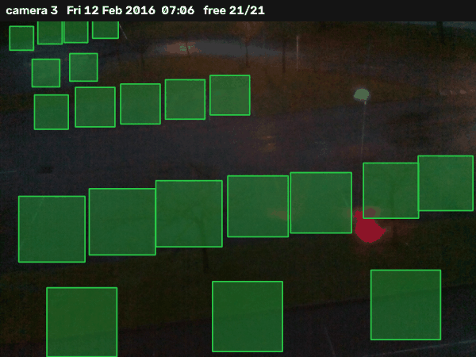
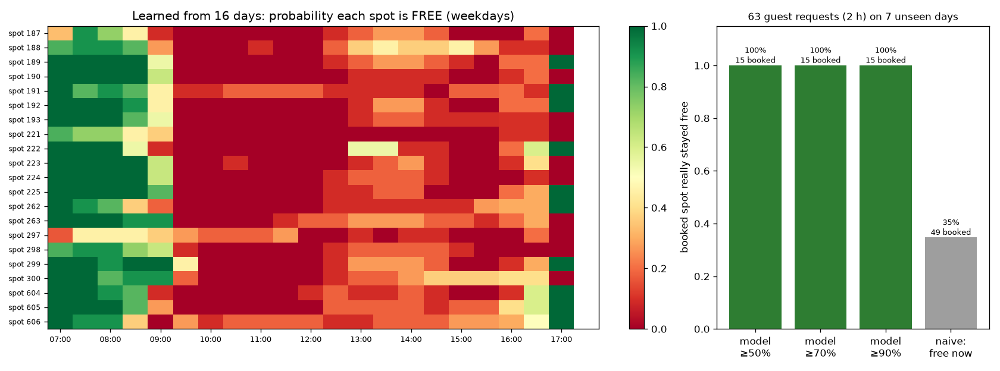
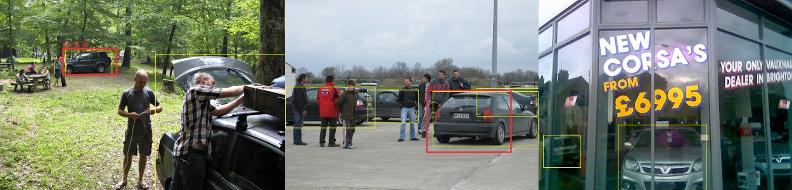

# Dynamic Parking Allotment for Residential Societies

In housing societies, every flat has an allotted parking spot, yet many spots
stand empty for hours (owners at the office) while visitors have nowhere to park.
This project watches the parking area with a fixed CCTV camera, works out which
spots are free, **learns when each spot is usually free**, and lends free spots
to guests for exactly as long as they are likely to stay free.

Classical computer vision only: HOG, LBP/GLCM texture and RGB/HSV colour features
with Logistic Regression, Random Forest, SVM and XGBoost, compared and selected
on **public datasets**.

## Demo: real CCTV footage, camera never seen in training



*CNRPark-EXT camera 3, one day (Fri 12 Feb 2016). Green = predicted free,
red = predicted occupied, yellow outline = the model disagrees with the human label.
The occupancy model was trained on other cameras only.*



**Left:** what the system learned from 16 days of its own predictions: the probability
that each spot is free, by time of day. It's an office car park, so spots are free
before 9:00 and after 17:00.
**Right:** 63 guest requests (2 h each) on 7 later days the system had not seen.
Every guest the system booked found the spot still free. The naive rule
"give any spot that is free right now" fails about 2 times in 3, because the
owner comes back.

| Demo result (camera 3, 23 days, 451 frames, 21 spots) | |
|---|---|
| Occupancy accuracy over 9,471 spot decisions | **95.2 %** (F1 0.958) |
| Guests booked by the availability model, spot really stayed free | **15 / 15 (100 %)** at every confidence level 50–90 % |
| Naive "free right now", spot really stayed free | 17 / 49 (35 %) |

Reproduce: `python scripts/demo.py --occupancy-model <model> --detector <detector> --out docs/demo`

## How it works

```
CCTV frame ──► spots (marked once, or discovered from parked cars)
          ──► each spot cropped + perspective-corrected
          ──► features: HOG · LBP · GLCM · RGB/HSV histograms
          ──► classifier (best of LogReg / RF / SVM / XGBoost) ──► free / occupied
          ──► occupancy log ──► P(spot stays free for the whole visit)
          ──► guest gets the safest free spot (or is told none is safe)
```

* **Spots** are marked once per camera (`annotate_spots.py`), or discovered
  automatically. A car detector finds cars; a place where a car stays parked and
  later leaves (and the pixels really change) becomes a spot (`discover_spots.py`).
* **Model selection:** every (feature set × model) combination is cross-validated
  with splits **by camera**, so a model is always tested on a camera it has not
  seen, like a new society. The winner is picked on CV F1; the test set is
  touched once.
* **Guest allotment:** for a request (start, hours), each spot gets the fraction
  of comparable past days (weekday/weekend) on which it stayed free for the whole
  window. The best spot above the confidence threshold is booked; residents'
  "I'm away" declarations, live camera status and existing bookings are respected.

## Results on public datasets

### 1. Occupancy (is this spot free?) on CNRPark-EXT

Real CCTV, 9 cameras, ~145k labelled spot images. Our camera placement
(elevated, on the side, looking diagonally) matches cameras 1, 2, 3 and 9.

| Training / test | Best model | Test F1 on an unseen camera |
|---|---|---|
| All 9 cameras (6,000 patches) | SVM + XGBoost + LogReg vote on all features | 0.978 |
| Side-angled cameras only, test = camera 3 | texture + colour, Random Forest | 0.955 |

On side-angled views **texture + colour beat HOG** (CV F1 0.940 vs 0.889): a car's
outline changes with the viewing angle, its texture and colour do not.
Full tables: `docs/results/`.

### 2. Car detector (draws a box around every car) on PASCAL VOC 2007

Used for automatic spot discovery: it has to find cars anywhere in a frame.
Real photos where every car is boxed; official split (5,011 trainval / 4,952 test
images, 1,250 / 1,201 cars). Two-stage sliding window: a fast linear HOG filter,
then the best (feature set × model) from the comparison below.

| CV F1, car vs background | LogReg | RF | SVM | XGBoost |
|---|---|---|---|---|
| hog | 0.782 | 0.820 | 0.874 | 0.865 |
| texture | 0.770 | 0.751 | 0.811 | 0.769 |
| color | 0.428 | 0.664 | 0.721 | 0.686 |
| hog + texture | 0.828 | 0.852 | 0.893 | 0.888 |
| **all** | 0.851 | 0.861 | **0.903** (selected) | 0.897 |



*VOC 2007 test photos. Red = detector (score ≥ 0.75), yellow = ground truth.*

## Quick start

```bash
pip install -r requirements.txt

# data (public): CNRPark-EXT for occupancy, PASCAL VOC 2007 for the car detector
python scripts/download_datasets.py cnrpark --patches
python scripts/download_datasets.py voc

# occupancy model, side-angled cameras, camera grouped CV
cat data/cnrpark/LABELS/camera{1,2,3,9}.txt > data/cnrpark/LABELS/side_cams.txt
python scripts/train_models.py --labels data/cnrpark/LABELS/side_cams.txt --images data/cnrpark/PATCHES \
       --group-level 2 --max-per-class 3000 --cv 3 --test-size 0.25 --out outputs/occupancy

# car detector (defaults = the settings used for the results above)
python scripts/train_detector.py --voc data/voc --out outputs/detector

# demo (writes the GIF, figures and numbers above)
python scripts/demo.py --occupancy-model outputs/occupancy/best_model.joblib \
       --detector outputs/detector/car_detector.joblib --out docs/demo

python -m pytest   # unit tests
```

### Run it on a camera

```bash
# 1. mark the spots once (opens a window: click 4 corners per spot)
python scripts/annotate_spots.py --image one_frame.jpg --out configs/my_spots.json

# 2. free/occupied for an image, a folder, a video file or a live stream
python scripts/detect.py --model outputs/occupancy/best_model.joblib --spots configs/my_spots.json \
       --source rtsp://<camera> --every 60 --smooth 5
```

`detect.py` prints the free spots, saves an annotated picture and appends to
`occupancy_log.csv`, the history the guest allotment learns from. Ready-made spots
for CNRPark camera 3: `configs/cnrpark_camera3_spots.json`. Instead of marking spots,
`discover_spots.py` finds them from a few days of footage with the car detector.
`crop_patches.py` turns your own frames into a labelled training set.

## Repository

```
parking/                 the library
  features.py            HOG, LBP, GLCM, RGB/HSV features
  models.py              LogReg / RF / SVM / XGBoost candidates, voting ensemble, saved model
  selection.py           grouped cross-validation and best-model selection
  data.py                spot-patch loaders (CNRPark-EXT label lists, own crops)
  annotations.py         frame loaders (CNRPark-EXT frames, PASCAL VOC), boxes, patch sampling
  spots.py               spot polygons, perspective crop, drawing
  detect.py              per-frame occupancy + temporal smoothing
  detector.py            sliding-window car detector (HOG stage 1 + best model stage 2)
  discovery.py           spot discovery from parked-car activity
  scheduler.py           occupancy history -> availability -> guest allocator
scripts/                 download, train, demo, and run on a camera
configs/                 spot polygons (CNRPark camera 3 example)
docs/demo/               demo outputs shown above
docs/results/            full result tables and figures
tests/                   unit tests (tiny synthetic fixtures, only to check the code)
```

## Datasets

| Dataset | Used for | Link |
|---|---|---|
| CNRPark-EXT | occupancy model, demo | http://cnrpark.it (Amato et al., ESWA 2017) |
| PASCAL VOC 2007 | car detector | http://host.robots.ox.ac.uk/pascal/VOC/ (Everingham et al., IJCV 2010) |

`scripts/download_datasets.py` downloads both. Please cite the original papers.
Worth trying next for our camera placement: ACPDS (~10 m side views,
https://github.com/martin-marek/parking-space-occupancy) and NDISPark (every car
boxed, day and night, https://zenodo.org/records/6560823).

## Limitations and next steps

* The demo car park is an office (busy all day). A residential society has the
  opposite pattern (free during office hours), which is where guests benefit most.
  The next step is footage from a society camera.
* Detector false alarms are the weak point of the classical approach; spot
  discovery tolerates them (a false alarm on a wall never "leaves", so it never
  becomes a confirmed spot), but a deep detector would be much stronger.
* Camera placement: an elevated side view (~10 m, mall-style) is assumed;
  Prof. Kulkarni first suggested ~10 ft looking along the lane. Both work with
  the same code.
